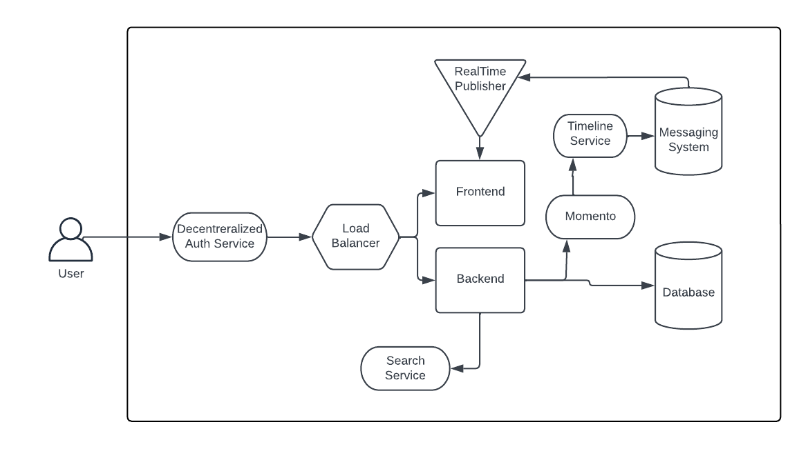
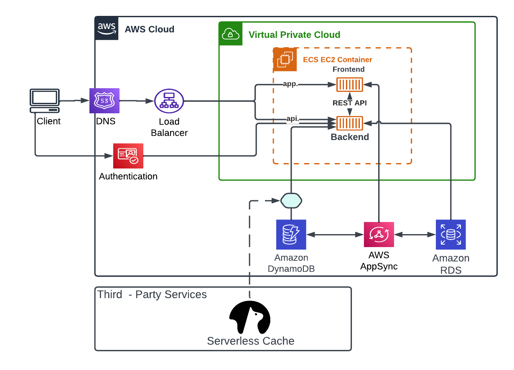

# Week 0 — Billing and Architecture


### - Created a new user and generated AWS credentials


### - Set and Saved Env Vars using `export` and `gp env` functions respectively


### - Added GitPod task in .gitpod.yml to install and auto prompt AWS CLI using

```sh
tasks:
  - name: aws-cli
    env:
      AWS_CLI_AUTO_PROMPT: on-partial
    init: |
      cd /workspace
      curl "https://awscli.amazonaws.com/awscli-exe-linux-x86_64.zip" -o "awscliv2.zip"
      unzip awscliv2.zip
      sudo ./aws/install
      cd $THEIA_WORKSPACE_ROOT
```


### - Created AWS budject via CLI

```sh
aws budgets create-budget \
    --account-id $AWS_ACCOUNT_ID \
    --budget file://aws/json/budget.json \
    --notifications-with-subscribers file://aws/json/budget-notifications-with-subscribers.json
```


### - Created SNS Topic Using

```sh
aws sns create-topic --name <SNS_TOPIC_NAME>
```


### - Subcribed to SNS 

```sh
aws sns subscribe \
    --topic-arn="TOPIC ARN" \
    --protocol email \
    --notification-endpoint=email
```


### - Created Alarm / Cloud watch

```sh
aws cloudwatch put-metric-alarm --cli-input-json file://aws/json/alarm-config.json
```


### - Enabled billing on root account from aws console, under billing preference.


### - Napkin Concentual Diagram


[Lucid Share link to Diagram](https://lucid.app/lucidchart/23a65ab2-40b7-45fb-8d21-04223c52002b/edit?viewport_loc=354%2C144%2C1520%2C1024%2C0_0&invitationId=inv_ad136087-1940-43ef-84c6-c95f992af04b)

### - Recreated Logical Diagram


[Lucid Share link to Diagram](https://lucid.app/lucidchart/1c34c89d-e378-4ae8-99e9-90187a956dc7/edit?viewport_loc=-1285%2C-58%2C1520%2C1024%2C0_0&invitationId=inv_d30c5502-17b0-4a0e-9f6f-490e72be59d7)
